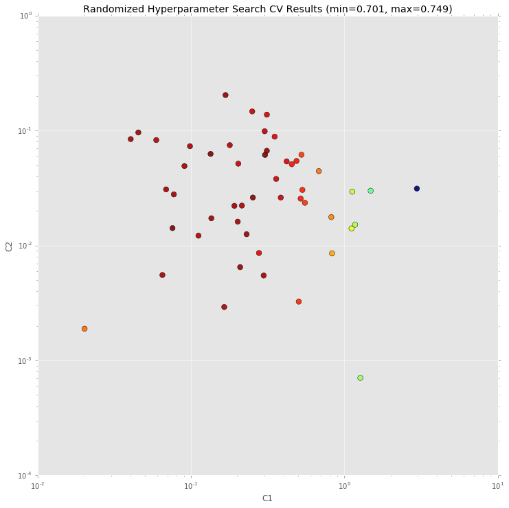

.. code:: python

    %matplotlib inline
    import matplotlib.pyplot as plt
    plt.style.use('ggplot')

.. code:: python

    from itertools import chain
    
    import nltk
    import sklearn
    import scipy.stats
    from sklearn.metrics import make_scorer
    from sklearn.cross_validation import cross_val_score
    from sklearn.grid_search import RandomizedSearchCV
    
    import sklearn_crfsuite
    from sklearn_crfsuite import scorers
    from sklearn_crfsuite import metrics

Let's use CoNLL 2002 data to build a NER system
-----------------------------------------------

CoNLL2002 corpus is available in NLTK. We use Spanish data.

.. code:: python

    nltk.corpus.conll2002.fileids()

.. parsed-literal::

    ['esp.testa', 'esp.testb', 'esp.train', 'ned.testa', 'ned.testb', 'ned.train']

.. code:: python

    %%time
    train_sents = list(nltk.corpus.conll2002.iob_sents('esp.train'))
    test_sents = list(nltk.corpus.conll2002.iob_sents('esp.testb'))

.. parsed-literal::

    CPU times: user 2.91 s, sys: 108 ms, total: 3.02 s
    Wall time: 3.13 s

.. code:: python

    train_sents[0]

.. parsed-literal::

    [('Melbourne', 'NP', 'B-LOC'),
     ('(', 'Fpa', 'O'),
     ('Australia', 'NP', 'B-LOC'),
     (')', 'Fpt', 'O'),
     (',', 'Fc', 'O'),
     ('25', 'Z', 'O'),
     ('may', 'NC', 'O'),
     ('(', 'Fpa', 'O'),
     ('EFE', 'NC', 'B-ORG'),
     (')', 'Fpt', 'O'),
     ('.', 'Fp', 'O')]

Features
--------

Next, define some features. In this example we use word identity, word
suffix, word shape and word POS tag; also, some information from nearby
words is used.

This makes a simple baseline, but you certainly can add and remove some
features to get (much?) better results - experiment with it.

sklearn-crfsuite (and python-crfsuite) supports several feature formats;
here we use feature dicts.

.. code:: python

    def word2features(sent, i):
        word = sent[i][0]
        postag = sent[i][1]
        
        features = {
            'bias': 1.0,
            'word.lower()': word.lower(),
            'word[-3:]': word[-3:],
            'word[-2:]': word[-2:],
            'word.isupper()': word.isupper(),
            'word.istitle()': word.istitle(),
            'word.isdigit()': word.isdigit(),
            'postag': postag,
            'postag[:2]': postag[:2],        
        }
        if i > 0:
            word1 = sent[i-1][0]
            postag1 = sent[i-1][1]
            features.update({
                '-1:word.lower()': word1.lower(),
                '-1:word.istitle()': word1.istitle(),
                '-1:word.isupper()': word1.isupper(),
                '-1:postag': postag1,
                '-1:postag[:2]': postag1[:2],
            })
        else:
            features['BOS'] = True
            
        if i < len(sent)-1:
            word1 = sent[i+1][0]
            postag1 = sent[i+1][1]
            features.update({
                '+1:word.lower()': word1.lower(),
                '+1:word.istitle()': word1.istitle(),
                '+1:word.isupper()': word1.isupper(),
                '+1:postag': postag1,
                '+1:postag[:2]': postag1[:2],
            })
        else:
            features['EOS'] = True
                    
        return features
    
    
    def sent2features(sent):
        return [word2features(sent, i) for i in range(len(sent))]
    
    def sent2labels(sent):
        return [label for token, postag, label in sent]
    
    def sent2tokens(sent):
        return [token for token, postag, label in sent]

This is what word2features extracts:

.. code:: python

    sent2features(train_sents[0])[0]

.. parsed-literal::

    {'+1:postag': 'Fpa',
     '+1:postag[:2]': 'Fp',
     '+1:word.istitle()': False,
     '+1:word.isupper()': False,
     '+1:word.lower()': '(',
     'BOS': True,
     'bias': 1.0,
     'postag': 'NP',
     'postag[:2]': 'NP',
     'word.isdigit()': False,
     'word.istitle()': True,
     'word.isupper()': False,
     'word.lower()': 'melbourne',
     'word[-2:]': 'ne',
     'word[-3:]': 'rne'}

Extract features from the data:

.. code:: python

    %%time
    X_train = [sent2features(s) for s in train_sents]
    y_train = [sent2labels(s) for s in train_sents]
    
    X_test = [sent2features(s) for s in test_sents]
    y_test = [sent2labels(s) for s in test_sents]

.. parsed-literal::

    CPU times: user 1.48 s, sys: 124 ms, total: 1.61 s
    Wall time: 1.65 s

Training
--------

To see all possible CRF parameters check its docstring. Here we are
useing L-BFGS training algorithm (it is default) with Elastic Net (L1 +
L2) regularization.

.. code:: python

    %%time
    crf = sklearn_crfsuite.CRF(
        algorithm='lbfgs', 
        c1=0.1, 
        c2=0.1, 
        max_iterations=100, 
        all_possible_transitions=True
    )
    crf.fit(X_train, y_train)

.. parsed-literal::

    CPU times: user 32 s, sys: 108 ms, total: 32.1 s
    Wall time: 32.3 s

Evaluation
----------

There is much more O entities in data set, but we're more interested in
other entities. To account for this we'll use averaged F1 score computed
for all labels except for O. ``sklearn-crfsuite.metrics`` package
provides some useful metrics for sequence classification task, including
this one.

.. code:: python

    labels = list(crf.classes_)
    labels.remove('O')
    labels

.. parsed-literal::

    ['B-LOC', 'B-ORG', 'B-PER', 'I-PER', 'B-MISC', 'I-ORG', 'I-LOC', 'I-MISC']

.. code:: python

    y_pred = crf.predict(X_test)
    metrics.flat_f1_score(y_test, y_pred, 
                          average='weighted', labels=labels)

.. parsed-literal::

    0.76980231377134023

Inspect per-class results in more detail:

.. code:: python

    # group B and I results
    sorted_labels = sorted(
        labels, 
        key=lambda name: (name[1:], name[0])
    )
    print(metrics.flat_classification_report(
        y_test, y_pred, labels=sorted_labels, digits=3
    ))

.. parsed-literal::

                 precision    recall  f1-score   support
    
          B-LOC      0.775     0.757     0.766      1084
          I-LOC      0.601     0.631     0.616       325
         B-MISC      0.698     0.499     0.582       339
         I-MISC      0.644     0.567     0.603       557
          B-ORG      0.795     0.801     0.798      1400
          I-ORG      0.831     0.773     0.801      1104
          B-PER      0.812     0.876     0.843       735
          I-PER      0.873     0.931     0.901       634
    
    avg / total      0.779     0.764     0.770      6178
    

Hyperparameter Optimization
---------------------------

To improve quality try to select regularization parameters using
randomized search and 3-fold cross-validation.

I takes quite a lot of CPU time and RAM (we're fitting a model
``50 * 3 = 150`` times), so grab a tea and be patient, or reduce n\_iter
in RandomizedSearchCV, or fit model only on a subset of training data.

.. code:: python

    %%time
    # define fixed parameters and parameters to search
    crf = sklearn_crfsuite.CRF(
        algorithm='lbfgs', 
        max_iterations=100, 
        all_possible_transitions=True
    )
    params_space = {
        'c1': scipy.stats.expon(scale=0.5),
        'c2': scipy.stats.expon(scale=0.05),
    }
    
    # use the same metric for evaluation
    f1_scorer = make_scorer(metrics.flat_f1_score, 
                            average='weighted', labels=labels)
    
    # search
    rs = RandomizedSearchCV(crf, params_space, 
                            cv=3, 
                            verbose=1, 
                            n_jobs=-1, 
                            n_iter=50, 
                            scoring=f1_scorer)
    rs.fit(X_train, y_train)

.. parsed-literal::

    Fitting 3 folds for each of 50 candidates, totalling 150 fits

.. parsed-literal::

    [Parallel(n_jobs=-1)]: Done  34 tasks      | elapsed:  4.1min
    [Parallel(n_jobs=-1)]: Done 150 out of 150 | elapsed: 16.1min finished

.. parsed-literal::

    CPU times: user 3min 34s, sys: 13.9 s, total: 3min 48s
    Wall time: 16min 36s

Best result:

.. code:: python

    # crf = rs.best_estimator_
    print('best params:', rs.best_params_)
    print('best CV score:', rs.best_score_)
    print('model size: {:0.2f}M'.format(rs.best_estimator_.size_ / 1000000))

.. parsed-literal::

    best params: {'c2': 0.06146442424219609, 'c1': 0.30343585910230675}
    best CV score: 0.748852160441
    model size: 1.08M

Check parameter space
~~~~~~~~~~~~~~~~~~~~~

A chart which shows which ``c1`` and ``c2`` values have
RandomizedSearchCV checked. Red color means better results, blue means
worse.

.. code:: python

    _x = [s.parameters['c1'] for s in rs.grid_scores_]
    _y = [s.parameters['c2'] for s in rs.grid_scores_]
    _c = [s.mean_validation_score for s in rs.grid_scores_]
    
    fig = plt.figure()
    fig.set_size_inches(12, 12)
    ax = plt.gca()
    ax.set_yscale('log')
    ax.set_xscale('log')
    ax.set_xlabel('C1')
    ax.set_ylabel('C2')
    ax.set_title("Randomized Hyperparameter Search CV Results (min={:0.3}, max={:0.3})".format(
        min(_c), max(_c)
    ))
    
    ax.scatter(_x, _y, c=_c, s=60, alpha=0.9, edgecolors=[0,0,0])
    
    print("Dark blue => {:0.4}, dark red => {:0.4}".format(min(_c), max(_c)))

.. parsed-literal::

    Dark blue => 0.7013, dark red => 0.7489

Check best estimator on our test data
-------------------------------------

As you can see, quality is improved.

.. code:: python

    crf = rs.best_estimator_
    y_pred = crf.predict(X_test)
    print(metrics.flat_classification_report(
        y_test, y_pred, labels=sorted_labels, digits=3
    ))

.. parsed-literal::

                 precision    recall  f1-score   support
    
          B-LOC      0.800     0.780     0.790      1084
          I-LOC      0.663     0.625     0.643       325
         B-MISC      0.729     0.555     0.630       339
         I-MISC      0.709     0.582     0.639       557
          B-ORG      0.808     0.824     0.816      1400
          I-ORG      0.849     0.783     0.814      1104
          B-PER      0.836     0.882     0.858       735
          I-PER      0.884     0.942     0.912       634
    
    avg / total      0.804     0.781     0.791      6178
    

Let's check what classifier learned
-----------------------------------

.. code:: python

    from collections import Counter
    
    def print_transitions(trans_features):
        for (label_from, label_to), weight in trans_features:
            print("%-6s -> %-7s %0.6f" % (label_from, label_to, weight))
    
    print("Top likely transitions:")
    print_transitions(Counter(crf.transition_features_).most_common(20))
    
    print("\nTop unlikely transitions:")
    print_transitions(Counter(crf.transition_features_).most_common()[-20:])

.. parsed-literal::

    Top likely transitions:
    B-ORG  -> I-ORG   7.029925
    I-ORG  -> I-ORG   6.672091
    B-MISC -> I-MISC  6.450077
    I-MISC -> I-MISC  6.420227
    B-PER  -> I-PER   5.898448
    B-LOC  -> I-LOC   5.293131
    I-LOC  -> I-LOC   4.669233
    I-PER  -> I-PER   4.327948
    O      -> O       3.773498
    O      -> B-ORG   2.723333
    O      -> B-PER   2.298990
    O      -> B-LOC   1.753950
    O      -> B-MISC  1.608865
    B-ORG  -> O       0.373792
    B-LOC  -> B-LOC   0.363950
    B-MISC -> B-ORG   0.213808
    B-ORG  -> B-LOC   0.122352
    I-PER  -> B-LOC   0.055117
    B-LOC  -> B-PER   -0.141696
    B-MISC -> O       -0.170980
    
    Top unlikely transitions:
    I-ORG  -> B-LOC   -2.281004
    I-LOC  -> I-PER   -2.285589
    I-MISC -> B-LOC   -2.286738
    I-LOC  -> B-MISC  -2.299090
    B-LOC  -> B-MISC  -2.312090
    I-ORG  -> I-PER   -2.636941
    I-ORG  -> B-MISC  -2.673906
    B-ORG  -> B-MISC  -2.735029
    I-PER  -> B-ORG   -2.822961
    B-PER  -> B-MISC  -2.857271
    I-MISC -> I-LOC   -2.902497
    I-PER  -> I-LOC   -2.931078
    I-ORG  -> I-LOC   -2.943800
    B-PER  -> B-PER   -3.063315
    I-PER  -> B-MISC  -3.373836
    B-MISC -> B-MISC  -3.435245
    O      -> I-MISC  -5.385205
    O      -> I-ORG   -5.670565
    O      -> I-PER   -6.003255
    O      -> I-LOC   -6.680094

We can see that, for example, it is very likely that the beginning of an
organization name (B-ORG) will be followed by a token inside
organization name (I-ORG), but transitions to I-ORG from tokens with
other labels are penalized.

Check the state features:

.. code:: python

    def print_state_features(state_features):
        for (attr, label), weight in state_features:
            print("%0.6f %-8s %s" % (weight, label, attr))    
    
    print("Top positive:")
    print_state_features(Counter(crf.state_features_).most_common(30))
    
    print("\nTop negative:")
    print_state_features(Counter(crf.state_features_).most_common()[-30:])

.. parsed-literal::

    Top positive:
    11.005266 B-ORG    word.lower():efe-cantabria
    9.385823 B-ORG    word.lower():psoe-progresistas
    6.715219 I-ORG    -1:word.lower():l
    5.638921 O        BOS
    5.378117 B-LOC    -1:word.lower():cantabria
    5.302705 B-ORG    word.lower():xfera
    5.287491 B-ORG    word[-2:]:-e
    5.239806 B-ORG    word.lower():petrobras
    5.214013 B-MISC   word.lower():diversia
    5.025534 B-ORG    word.lower():coag-extremadura
    5.020590 B-ORG    word.lower():telefónica
    4.804399 B-MISC   word.lower():justicia
    4.729711 B-MISC   word.lower():competencia
    4.705013 O        postag[:2]:Fp
    4.695208 B-ORG    -1:word.lower():distancia
    4.681021 I-ORG    -1:word.lower():rasd
    4.636151 I-LOC    -1:word.lower():calle
    4.618459 B-ORG    word.lower():terra
    4.580418 B-PER    -1:word.lower():según
    4.574348 B-ORG    word.lower():esquerra
    4.537127 O        word.lower():r.
    4.537127 O        word[-3:]:R.
    4.536578 B-MISC   word.lower():cc2305001730
    4.510408 B-ORG    +1:word.lower():plasencia
    4.471889 B-LOC    +1:word.lower():finalizaron
    4.451102 B-LOC    word.lower():líbano
    4.423293 B-ORG    word.isupper()
    4.379665 O        word.lower():euro
    4.361340 B-LOC    -1:word.lower():celebrarán
    4.345542 I-MISC   -1:word.lower():1.9
    
    Top negative:
    -2.006512 I-PER    word[-3:]:ión
    -2.020133 B-PER    word[-2:]:os
    -2.027996 O        +1:word.lower():campo
    -2.028221 O        +1:word.lower():plasencia
    -2.043293 O        word.lower():061
    -2.097561 O        postag:NP
    -2.097561 O        postag[:2]:NP
    -2.115992 O        word[-3:]:730
    -2.156136 O        word.lower():circo
    -2.173247 B-LOC    word[-3:]:la
    -2.223739 I-PER    +1:word.lower():del
    -2.323688 B-MISC   -1:word.isupper()
    -2.347859 O        -1:word.lower():sánchez
    -2.378442 I-PER    word[-3:]:ico
    -2.404641 I-PER    +1:word.lower():el
    -2.414000 O        word[-3:]:bas
    -2.495209 O        -1:word.lower():británica
    -2.539839 B-PER    word[-3:]:nes
    -2.596765 O        +1:word.lower():justicia
    -2.621004 O        -1:word.lower():sección
    -2.981810 O        word[-3:]:LOS
    -3.046486 O        word[-2:]:nd
    -3.162064 O        -1:word.lower():españolas
    -3.219096 I-PER    -1:word.lower():san
    -3.562049 B-PER    -1:word.lower():del
    -3.580405 O        word.lower():mas
    -4.119731 O        word[-2:]:om
    -4.301704 O        -1:word.lower():celebrarán
    -5.632036 O        word.isupper()
    -8.215073 O        word.istitle()

Some observations:

-  **9.385823 B-ORG word.lower():psoe-progresistas** - the model
   remembered names of some entities - maybe it is overfit, or maybe our
   features are not adequate, or maybe remembering is indeed helpful;
-  **4.636151 I-LOC -1:word.lower():calle:** "calle" is a street in
   Spanish; model learns that if a previous word was "calle" then the
   token is likely a part of location;
-  **-5.632036 O word.isupper()**, **-8.215073 O word.istitle()** :
   UPPERCASED or TitleCased words are likely entities of some kind;
-  **-2.097561 O postag:NP** - proper nouns (NP is a proper noun in the
   Spanish tagset) are often entities.

What to do next

::

    * Load 'testa' Spanish data.
    * Use it to develop better features and to find best model parameters.
    * Apply the model to 'testb' data again.

The model in this notebook is just a starting point; you certainly can
do better!

